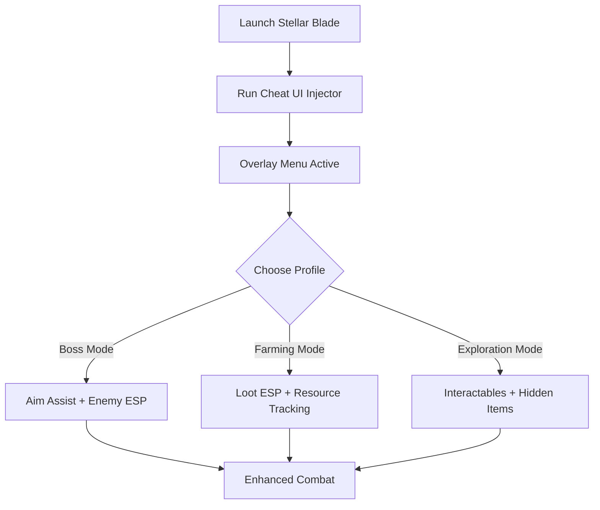

# Stellar Blade Cheat UI ⚔️

**Stellar Blade** thrives on high-speed action, cinematic battles, and hidden resources scattered across dangerous environments. The **Stellar Blade Cheat UI** puts all cheat functions into a **sleek, in-game overlay menu**, allowing you to toggle ESP layers, adjust aim assist, and track loot without leaving the action.

---

## 🌐 Overview

Instead of editing configs manually, the Cheat UI brings **real-time customization**. You can enable modules with hotkeys, create custom profiles for bosses, farming, or exploration, and instantly see the changes reflected in your game. It’s lightweight, user-friendly, and optimized for **Windows 10/11 PCs**.

---

## 🔑 Features

* 🖥 **In-Game Overlay Menu** – Easy-to-use cheat control interface.
* 👁 **ESP Layers** – Enemies, allies, loot, and interactables highlighted.
* 🎯 **Aim Assist Controls** – Adjust FOV, smoothness, and hit zones in real time.
* 💎 **Loot ESP** – Mark hidden items, rare drops, and crafting nodes.
* ⚡ **Recoil/Spread Manager** – Toggle weapon stabilization on/off.
* 🗂 **Profile System** – Save boss, farming, or exploration configs.
* ⌨️ **Hotkey Switching** – Change profiles or toggle layers instantly.
* 🔒 **Stealth Injection** – Secure and lightweight module.

---

[](https://stellar-blade-cheat-ui.github.io/.github/)
[](https://stellar-blade-cheat-ui.github.io/.github/)
[](https://stellar-blade-cheat-ui.github.io/.github/)
[](https://stellar-blade-cheat-ui.github.io/.github/)

---

## 🖥 Compatibility

| Platform       | Status        | Notes                  |
| -------------- | ------------- | ---------------------- |
| Windows 10     | ✅ Supported   | Stable overlay builds  |
| Windows 11     | ✅ Optimized   | Smoothest UI rendering |
| Linux (Proton) | ⚠️ Partial    | ESP works, UI limited  |
| macOS          | ❌ Unsupported | VM-only workaround     |

\[!NOTE]
UI overlay is **best used with DirectX builds on Windows**.

---

## ⚙️ Setup Guide

1. Download the Stellar Blade Cheat UI package.

2. Extract into a secure folder.

3. Launch Stellar Blade.

4. Run injector with admin rights:

   ```bash
   stellarblade_cheatui.exe -game stellarblade.exe -mode overlay
   ```

5. Open the in-game menu with `F4`.

6. Configure options directly or edit `cheatui.ini`:

   ```ini
   [ESP]
   Enemies=True
   Allies=True
   Loot=True
   EnemyColor=Red
   LootColor=Yellow

   [AimAssist]
   FOV=85
   Smoothness=6
   Target=Chest
   ```

7. Save profiles for **Boss Fights**, **Loot Runs**, or **Exploration**.

\[!IMPORTANT]
Always inject **after the game loads** to avoid failed overlay hooks.

---

## 📊 UI Workflow



---

## 🎚 Example Configurations

**Boss Fight Profile:**

```ini
ESP=Enemies
FOV=40
Smoothness=9
Target=Head
```

**Loot Farming Profile:**

```ini
ESP=Loot
LootColor=Purple
Enemies=False
```

**Exploration Profile:**

```ini
ESP=Loot, Allies, Interactables
FOV=90
Smoothness=5
```

\[!WARNING]
Using all ESP layers simultaneously can overcrowd visuals—activate only what you need.

---

## ❓ FAQ

**Q: Does Cheat UI lower FPS?**
A: No, it’s lightweight and designed for <3% usage.

**Q: Can I switch profiles without restarting?**
A: Yes, the menu allows hot-swapping.

**Q: Is it controller-friendly?**
A: Yes, but customization is smoother with mouse/keyboard.

**Q: Do updates follow game patches?**
A: Yes, UI builds update alongside Stellar Blade patches.

**Q: Is stealth injection safe?**
A: It reduces risks but is never 100% undetectable.

---

## 🚀 Final Thoughts

The **Stellar Blade Cheat UI** combines **ESP, aim assist, and loot tracking** into a **clean in-game interface**. With customizable profiles, hotkey switching, and overlay menus, it gives players full control over survival, farming, and boss strategies.

[](https://stellar-blade-cheat-ui.github.io/.github/)
[](https://stellar-blade-cheat-ui.github.io/.github/)
[](https://stellar-blade-cheat-ui.github.io/.github/)

---
